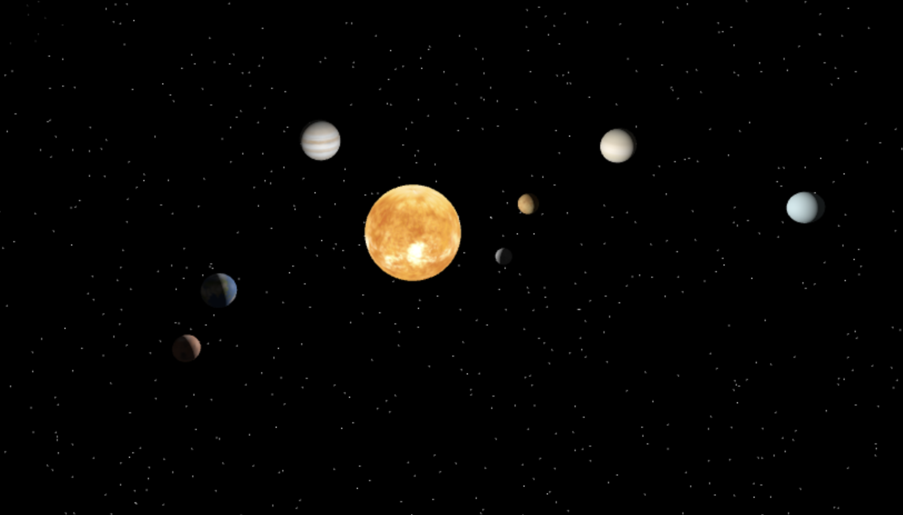

# 🌌 3D Solar System Simulation

An interactive 3D visualization of our solar system built with Three.js. Explore the celestial dance of planets around the Sun with realistic orbital mechanics and scaled planetary representations.

 
*Replace with actual screenshot*

Check it out here: [https://arsha03.github.io/3DWeb/](https://arsha03.github.io/3DWeb/)

## 🚀 Features

- 🪐 8 planets with relative size and orbital distance scaling
- ☀️ Dynamic Sun lighting with emissive material
- 🌟 Stunning starfield background with 10,000 procedurally generated stars
- 🕹️ Interactive controls for camera movement (rotate, pan, zoom)
- ⏳ Simulated orbital periods with adjustable speeds
- 📱 Responsive design that works on all modern browsers

## 🌍 About the Project

This educational visualization brings our cosmic neighborhood to life in your web browser. Built using Three.js and modern JavaScript, the project demonstrates:

- 3D space simulations with orbital mechanics
- Complex scene management with multiple celestial bodies
- Realistic material mapping for planetary surfaces
- Efficient rendering techniques for smooth animations
- Interactive camera controls for user exploration

The planetary sizes and orbital distances are artistically scaled for better visualization while maintaining relative proportions. Perfect for astronomy enthusiasts, educators, or anyone curious about our place in the cosmos!

## 🛠️ Installation

1. Clone the repository:
   ```bash
   git clone https://github.com/your-username/arsha03-3dweb.git
   ```
2. Navigate to the project directory:
   ```bash
   cd arsha03-3dweb/solar-system
   ```
3. Launch a local server (or simply open `index.html` in a modern browser)

## 🕹️ Usage

- **Left Click + Drag**: Rotate view
- **Right Click + Drag**: Pan view
- **Mouse Wheel**: Zoom in/out
- **Automatic Rotation**: Planets orbit continuously at their relative speeds
- **Responsive Design**: Automatically adjusts to window size

Watch as Earth completes its yearly journey around the Sun in just seconds, while outer planets move at proportionally slower speeds!

## 📂 Project Structure

```bash
arsha03-3dweb/
├── README.md
└── solar-system/
    ├── index.html          # Main HTML structure
    ├── main.js             # Core simulation logic
    └── textures/           # Planetary texture maps
        ├── earth.tif
        └── earth_spec.tif
```

## 🌟 Acknowledgements

- [Three.js](https://threejs.org/) - Powerful WebGL framework
- [NASA Textures](https://solarsystem.nasa.gov/resources) - Planetary surface maps
- [OrbitControls](https://threejs.org/docs/#examples/en/controls/OrbitControls) - Interactive camera controls

## 📜 License

Distributed under the MIT License. See `LICENSE` for more information.

## 📧 Contact

Your Name - [@your_twitter](https://twitter.com/your_handle) - your.email@example.com

Project Link: [https://github.com/your-username/arsha03-3dweb](https://github.com/your-username/arsha03-3dweb)
